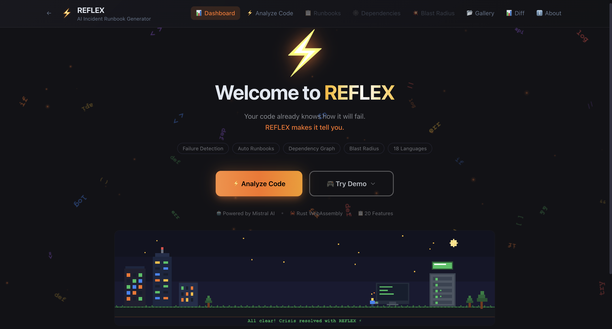

# REFLEX ⚡

<div align="center">

[](https://github.com/wiqilee/reflex)
[](https://mistral.ai)
[](https://mistral.ai)

[](https://fastapi.tiangolo.com)
[](https://rust-lang.org)
[](https://react.dev)
[](https://github.com/wiqilee/reflex/actions)
[](https://github.com/wiqilee/reflex/actions)

**Your code already knows how it will fail. REFLEX makes it tell you.**

### 🚀 Live Demo

[](https://YOUR_PROJECT.vercel.app)

### 🎬 Video Demo

[](https://youtube.com/watch?v=YOUR_VIDEO_ID)

[Features](#-features-20) · [Quick Start](#-quick-start) · [Architecture](#️-architecture) · [API Reference](#-api-reference) · [Who Benefits](#-who-benefits)

[](.) [](.) [](.) [](.) [](.) [](.)

</div>

---

## For Judges - Quick Walkthrough (2 minutes)

1. **Open the app** - Dashboard with pixel art animation
2. **Click "Try Demo"** - Choose one of **6 languages** (Python, Go, Rust, Java, TypeScript, YAML)
3. **Wait ~15s** - Mistral Large 3 analyzes via function calling (not free-form text)
4. **Dashboard** - Severity breakdown, failure scenarios with severity reasoning
5. **🔍 Code View** - Source code with line-by-line severity highlighting - click any red line to jump to its runbook
6. **📋 Runbooks** - 5-phase structure with copy-paste commands, L1/L2/L3 tooltips
7. **🕸️ Dependencies** - Click any node to see related runbooks in a side panel
8. **💥 Blast Radius** - Cascading failure simulation (Rust WASM, sub-ms, client-side)
9. **📊 Diff** - Compare two analyses: see fixed issues, new issues, risk score change
10. **Export/Translate** - Markdown export, 18-language translation

**Key differentiators:** Mistral function calling with 3 typed tools · Multi-pass runbook validation · Rust WASM simulation · Code-to-runbook line mapping · Analysis diff tracking · 20 features total.

---

## Before / After - 30-Second Proof

**Input:** A 50-line Python payment service with SQL injection, missing timeouts, and no connection pooling.

**Output (in ~15 seconds):**

```
┌─────────────────────────────────────────────────┐
│ 8 failure scenarios detected                    │
│ 3 critical · 2 high · 2 medium · 1 low          │
│                                                 │
│ FS-001 SQL Injection in process_payment         │
│ Severity: CRITICAL                              │
│ Why: f-string SQL on line 37 with raw user_id   │
│                                                 │
│ Runbook Detection Step:                         │
│ $ grep -rn "f\".*SELECT\|f\".*INSERT" *.py      │
│ Expected: Lines with string interpolation in SQL│
│                                                 │
│ Fix Step:                                       │
│ $ Replace f-strings with parameterized queries  │
│ cursor.execute("INSERT INTO payments (user_id,  │
│   amount) VALUES (?, ?)", (user_id, amount))    │
│                                                 │
│ Blast Radius: 4 nodes, 100% system, 70k users   │
└─────────────────────────────────────────────────┘
```

**After fixing and re-analyzing:** Diff view shows ↓38% risk reduction, 3 critical - 0.

---

## The Problem

> I built REFLEX to solve a problem I’ve lived. As a software engineer, I’ve dealt with stale runbooks, broken commands, and 3 a.m. incidents where the documentation made things worse, not better. Nearly every team has a story like this. An outdated runbook turns a quick fix into a prolonged outage. REFLEX is more than a hackathon project to me. I believe automated runbook generation can save teams significant time and help prevent avoidable production incidents. If REFLEX helps even one on-call engineer sleep better at night, it was worth building.

It is 3 AM. PagerDuty goes off. Production is down.

The on-call engineer opens the runbook. It was written six months ago for a system refactored twice since. Half the commands are broken. The person who wrote it left the company in October.

**Every engineering team has this problem.** Runbooks are mission-critical but universally neglected because writing good ones takes weeks and they go stale within days.

---

## The Solution

<div align="center">



*"REFLEX analyzing a Rust cache service: failure scenarios, severity breakdown, and interactive dependency graph."*

</div>

REFLEX reads your actual code and generates production-ready incident runbooks automatically.

Paste your infrastructure code. REFLEX identifies many common high-impact failure modes your system can produce and generates structured, step-by-step runbooks with exact commands to run, expected output at each stage, rollback procedures, and prevention measures.

**How it works:** Mistral Large 3 (`mistral-large-latest`) powers the failure analysis through structured function calling - not free-form text generation. Each analysis goes through 3 typed tool calls with validated outputs, plus a second validation pass for critical/high severity runbooks. Rust compiled to WebAssembly handles dependency graph simulation directly in the browser.

---

## Why Not Just Ask ChatGPT?

A reasonable question. Here is why REFLEX exists as a dedicated tool instead of a prompt:

| Criteria | ChatGPT | REFLEX |
|---|---|---|
| **Input** | One question at a time, conversational | Entire codebase analyzed in one shot |
| **Output** | Free-form text (you parse it yourself) | Structured 5-phase runbooks with typed schemas |
| **Validation** | Single pass, no self-review | Multi-pass: critical runbooks get a second AI review |
| **Blast radius** | Cannot simulate cascading failures | Rust WASM simulation, sub-ms, client-side |
| **Dependencies** | No graph visualization | Interactive dependency graph with failure modes |
| **Tracking** | No history, starts fresh each time | Gallery mode, analysis diff, risk score comparison |
| **On-call tiers** | Does not understand L1/L2/L3 | Built-in access level annotations per step |
| **Translation** | Manual re-prompting per language | One-click 18-language translation |
| **Consistency** | Output format varies every time | Enforced structure via Mistral function calling |

ChatGPT is a general-purpose assistant. REFLEX is a specialized pipeline that understands the difference between a detection step and a rollback procedure, knows that critical runbooks need validation, and can simulate what happens when your payment service goes down at 3 AM.

---

## Why This Matters

Incident response runs on some of the worst documentation in the industry. According to Gartner, the average cost of IT downtime is $5,600 per minute. PagerDuty's 2024 report found that 69% of organizations take more than an hour to resolve incidents, often because responders lack clear, actionable guidance.

REFLEX exists because runbooks should be generated from the source of truth - the code itself.

---

## Who Benefits

| Role | How REFLEX Helps | Time Saved |
|---|---|---|
| 🔧 **SRE / Platform Engineers** | Auto-generate and maintain runbooks from actual code. Every code change produces updated documentation instantly - no more stale runbooks. | Weeks → minutes |
| 🌙 **On-Call Engineers** | Step-by-step guidance at 3 AM with exact commands, expected outputs, and clear escalation paths. No more guessing or scrolling through Slack. | Hours → minutes per incident |
| 📊 **Engineering Managers** | Reduce MTTR, minimize blast radius, and ensure consistent incident response across the entire team regardless of experience level. | Measurable risk reduction |
| 🚀 **Startups & Scale-ups** | Enterprise-grade incident documentation without a dedicated SRE team. One developer gets the same quality that large orgs spend months building. | $0 vs $50k+ consulting |
| 🎓 **Students & Learners** | Understand how production systems fail. Analyze demo code in 6 languages and learn infrastructure patterns from generated runbooks. | Accelerated learning |
| 🌍 **Global Teams** | 18-language runbook translation means every on-call engineer reads in their native language. Technical terms stay intact. | Zero translation overhead |

---

## Responsible Use

REFLEX is designed to support - not replace - human judgment in incident response.

- **Runbooks are starting points.** Always review generated commands before running them in production. REFLEX provides structured guidance, but every environment is unique.
- **No sensitive data stored.** Code you paste is sent to Mistral's API for analysis and is not stored by REFLEX. Check Mistral's data policy for API-level details.
- **Not a security scanner.** REFLEX identifies failure modes and operational risks, not CVEs or vulnerability databases. Use dedicated security tools for penetration testing.
- **Human in the loop.** Critical decisions - rollbacks, data migrations, permission escalations - should always involve a qualified engineer reviewing the suggested steps.

---

## Features (20)

### Core Analysis

1. **Failure Scenario Detection.** Mistral analyzes your code and identifies common high-impact failure modes: network partitions, connection exhaustion, race conditions, resource leaks, authentication failures, cascading timeouts, and more. Each scenario is classified by severity, likelihood, and affected code location.

2. **Severity Reasoning.** Every severity assignment comes with a detailed explanation: "Critical because: f-string SQL on line 37, no input validation, affects payment database with 3 downstream services." Visible on dashboard cards, runbook headers, and code view tooltips.

3. **Structured Runbook Generation.** Every runbook follows a rigid 5-phase structure: Detection → Diagnosis → Fix → Rollback → Prevention. Copy-pasteable terminal commands with expected output at every step.

4. **Multi-Pass Runbook Validation.** Critical and high-severity runbooks go through a second Mistral review pass. An "SRE reviewer" checks command accuracy, adds missing steps, corrects access levels, and flags dangerous operations.

5. **On-Call Tiering.** L1/L2/L3 access levels with hover tooltips explaining what each tier means. An L1 engineer at 3 AM should never guess whether to wake someone more senior.

6. **6-Language Demo Mode.** Built-in code samples in Python, Go, Rust, Java, TypeScript, and YAML/Docker. Each is a realistic microservice with intentional failure points.

### Code Intelligence

7. **Code Line Highlighting.** After analysis, view your source code with severity-colored gutter markers on every affected line. Hover for tooltip with scenario details. Click to jump directly to the relevant runbook.

8. **Dependency Graph Visualization.** Interactive graph of all service dependencies and failure modes. Hover nodes for details. Click nodes to see related runbooks in a side panel.

9. **Graph → Runbook Linking.** Click any node in the dependency graph to see which runbooks are relevant to that service. Smart matching across affected_code, titles, and descriptions.

10. **Failure Path Simulation.** Rust WASM engine simulates cascading failures through the dependency graph. Select a node, watch the cascade propagate. Also computes cyclomatic complexity, nesting depth, and coupling metrics for uploaded code - entirely client-side at sub-millisecond speed.

11. **Blast Radius Calculator.** Quantified impact: nodes affected, cascade depth, users impacted, system percentage. Prioritize which runbooks to review first.

### Developer Experience

12. **Analysis Diff / Compare.** Compare two analyses side-by-side: fixed issues (strikethrough green), new issues (red), persistent with severity changes. Risk score with weighted formula.

13. **Multi-File Analysis.** Upload multiple files. REFLEX correlates failure scenarios across service boundaries.

14. **Markdown Export.** One-click export of individual runbooks or full reports as clean Markdown.

15. **18-Language Translation.** Translate runbooks using Mistral's multilingual capabilities. Technical terms and command syntax stay untouched.

16. **Runbook Regeneration.** Changed your code? Regenerate specific runbooks without re-running the full analysis.

17. **Analysis Gallery & History.** Every analysis auto-saved with timestamps. Compare, reload, or delete past analyses.

18. **Interactive API Docs.** Full Swagger UI at `/docs` with schemas and try-it-out.

19. **Health Monitoring.** Built-in health check endpoint for deployment verification.

20. **Pixel Art Dashboard.** Custom animated pixel art scenes with 7 frames for a distinctive visual identity.

---

## Architecture

```
    Browser (Client)                     Server (FastAPI)                  Mistral AI
    +-----------------+                  +-------------------+            +------------------+
    |                 |   POST /analyze  |                   |  Function  |                  |
    | React Frontend  |----------------->| Analysis Engine   |----------->| mistral-large-   |
    | + Tailwind CSS  |                  |                   |  Calling   | latest           |
    |                 |<-----------------| Code Parser       |<-----------| (Mistral Large 3)|
    | Dependency      |   JSON Response  | Export Engine     |            |                  |
    | Graph (D3)      |                  | Multilingual Svc  |            | 3 Typed Tools:   |
    |                 |                  +-------------------+            | - report_failure |
    | Rust WASM       |                                                   | - generate_runbk |
    | Engine          |                                                   | - report_deps    |
    | - Failure Sim   |                                                   +------------------+
    | - Blast Radius  |
    +-----------------+
```

| Layer | Technology | Role |
|---|---|---|
| **AI Engine** | `mistral-large-latest` (Mistral Large 3) | Structured failure analysis via function calling with 3 typed tools + validation pass |
| **Backend** | Python, FastAPI | Async API orchestration, code parsing, export, translation |
| **Simulation** | Rust → WebAssembly | Sub-millisecond failure path simulation, cyclomatic complexity scoring, nesting analysis - entirely client-side |
| **Frontend** | React, TypeScript, Tailwind CSS, Zustand | Interactive dashboard, code viewer, dependency graph, blast radius |

### Why Mistral Function Calling?

Most AI tools generate free-form text and hope the output is structured enough to parse. REFLEX uses Mistral's function calling to enforce structure at the model level:

1. **`report_failure_scenarios`**: Severity with reasoning, category, likelihood, affected code references
2. **`generate_runbook`**: 5-phase runbook with typed step objects (command, expected output, access level)
3. **`report_dependencies`**: Typed node/edge structures for graph visualization

Output is guaranteed machine-parseable. No brittle regex parsing.

### Why Rust WebAssembly?

- **No server round trip** for interactive simulations or complexity analysis
- **Sub-millisecond performance** for cascading failure graphs and code metrics
- **Cyclomatic complexity scoring** computed client-side: decision points, nesting depth, coupling metrics, hotspot detection
- **Deterministic execution** with no garbage collection pauses
- **Portable** across every modern browser

---

## Quick Start

### Prerequisites

- Python 3.10+, Node.js 18+
- Mistral API key ([get one here](https://console.mistral.ai/))

### Installation & Run

```bash
git clone https://github.com/wiqilee/reflex.git
cd reflex
pip install -r requirements.txt
cp .env.example .env  # Add your MISTRAL_API_KEY

# Terminal 1: Backend
uvicorn backend.main:app --reload --port 8000

# Terminal 2: Frontend
cd frontend && npm install && npm run dev
```

### Quick Test

```bash
curl http://localhost:8000/api/v1/demo | python -m json.tool
```

### Run Tests

```bash
pip install pytest pytest-asyncio
pytest tests/ -v
```

---

## API Reference

| Method | Endpoint | Description |
|---|---|---|
| `GET` | `/` | Service info |
| `GET` | `/health` | Health check |
| `POST` | `/api/v1/analyze` | Analyze single file |
| `POST` | `/api/v1/analyze/multi` | Multi-file analysis |
| `GET` | `/api/v1/demo` | Demo analysis |
| `POST` | `/api/v1/runbook/{id}` | Regenerate runbook |
| `POST` | `/api/v1/export/markdown` | Export as Markdown |
| `POST` | `/api/v1/export/runbook/{idx}` | Export single runbook |
| `GET` | `/api/v1/languages` | List 18 translation languages |
| `POST` | `/api/v1/translate?lang=id` | Translate report |

---

## Project Structure

```
reflex/
├── .github/
│   └── workflows/
│       └── ci.yml                 # Lint, test, and typecheck pipeline
├── backend/
│   ├── main.py                    # FastAPI app and routing
│   ├── models.py                  # Pydantic models (with severity_reasoning)
│   └── services/
│       ├── mistral_client.py      # 3 function calling tools + validate_runbook
│       ├── analyzer.py            # Pipeline: detect, generate, validate, graph
│       ├── exporter.py            # Markdown export
│       └── multilingual.py        # 18-language translation
├── engine/
│   ├── src/
│   │   └── lib.rs                 # Rust WASM: failure sim, blast radius, cyclomatic complexity
│   └── Cargo.toml
├── frontend/src/
│   ├── App.tsx                    # Router with 9 views
│   ├── components/
│   │   ├── Dashboard.tsx          # Stats, severity breakdown, 6-lang demo
│   │   ├── CodeEditor.tsx         # Code input with 6-lang demo dropdown
│   │   ├── CodeAnalysisView.tsx   # Line-by-line severity highlighting
│   │   ├── RunbookViewer.tsx      # 5-phase viewer with L1/L2/L3 tooltips
│   │   ├── DependencyGraph.tsx    # Interactive graph + related runbooks panel
│   │   ├── BlastRadiusView.tsx    # Cascade sim + heatmap
│   │   ├── AnalysisDiff.tsx       # Before/after comparison
│   │   ├── Gallery.tsx            # Saved analyses
│   │   └── About.tsx              # Pixel art + feature showcase
│   ├── hooks/
│   │   ├── useStore.ts            # Zustand (analyzedCode, gallery, diff)
│   │   └── useAnalysis.ts         # API client + demo loader
│   └── data/
│       ├── demo.ts                # Offline fallback
│       └── demoSnippets.ts        # 6-language demo samples
├── tests/
│   └── test_reflex.py             # Model, pipeline, and edge case tests
├── docs/
│   └── screenshot.png              # App screenshot for README
└── README.md
```

---

## Supported Languages

**Code Analysis:** Python, Go, Rust, Java, TypeScript, YAML/Docker (with built-in demo samples for each).

**Runbook Translation:** 🇬🇧 English, 🇫🇷 French, 🇩🇪 German, 🇪🇸 Spanish, 🇧🇷 Portuguese, 🇮🇹 Italian, 🇳🇱 Dutch, 🇷🇺 Russian, 🇨🇳 Chinese (Simplified), 🇹🇼 Chinese (Traditional), 🇯🇵 Japanese, 🇰🇷 Korean, 🇸🇦 Arabic, 🇮🇳 Hindi, 🇹🇷 Turkish, 🇵🇱 Polish, 🇮🇩 Indonesian, 🇻🇳 Vietnamese.

---

## Limitations

- **Model dependency.** Analysis quality depends entirely on Mistral Large 3's understanding of the submitted code. Complex multi-file architectures with indirect dependencies may produce incomplete scenario coverage.
- **Single-pass code parsing.** The current pipeline sends code as raw text. There is no AST-level parsing, which means some language-specific patterns (e.g. Rust lifetimes, Go goroutine leaks) may be under-reported.
- **No persistent storage.** Gallery saves to `localStorage`. Clearing browser data removes all saved analyses.
- **Rate limiting.** Mistral API rate limits apply. Concurrent analyses from multiple users on a shared deployment will queue.
- **Translation fidelity.** Runbook translation preserves command syntax but may occasionally localize technical terms that should remain in English.

## Future Work

- **CI/CD integration.** GitHub Action that auto-regenerates runbooks on merge to main, with diff against previous version committed as PR comment.
- **AST-aware analysis.** Integrate `tree-sitter` for language-specific parsing. Extract call graphs, type annotations, and dependency injection patterns before sending to Mistral.
- **Terraform / Kubernetes.** Extend failure detection to infrastructure-as-code: misconfigured health checks, missing resource limits, overly permissive RBAC.
- **PagerDuty / Opsgenie export.** One-click push of generated runbooks directly into incident management platforms.
- **VS Code extension.** Inline failure annotations in the editor gutter, powered by the same Mistral analysis pipeline.

---

## Contributing

Contributions welcome. Open an issue first to discuss your proposed change. For major features, a short design note in the issue thread helps align on approach before implementation.

---

## License

MIT License. See [LICENSE](LICENSE) for details.

---

## Disclaimer

REFLEX is an AI-assisted tool designed to support, not replace, human judgment. All generated runbooks, failure analyses, and severity assessments may contain inaccuracies inherent in AI systems. Always review generated commands before running them in production and consult senior engineers for high-stakes incidents.

---

<div align="center">

### 🧑‍💻 Built by [Wiqi Lee](https://x.com/wiqi_lee)

| Platform | Handle |
|---|---|
| 🐦 Twitter | [@wiqi_lee](https://x.com/wiqi_lee) |
| 💻 GitHub | [wiqilee](https://github.com/wiqilee) |
| 💬 Discord | [wiqi_lee](https://discord.com/users/209385020912173066) |

---

⭐ **Star this repo if you find it useful!**

---

[](https://mistral.ai)
[](https://mistral.ai)

🏆 **Built for the Mistral Worldwide Hackathon 2026**

</div>
